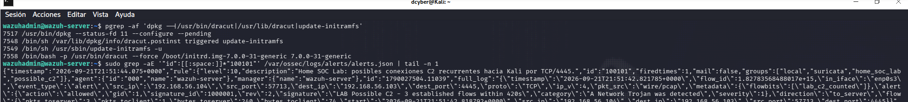
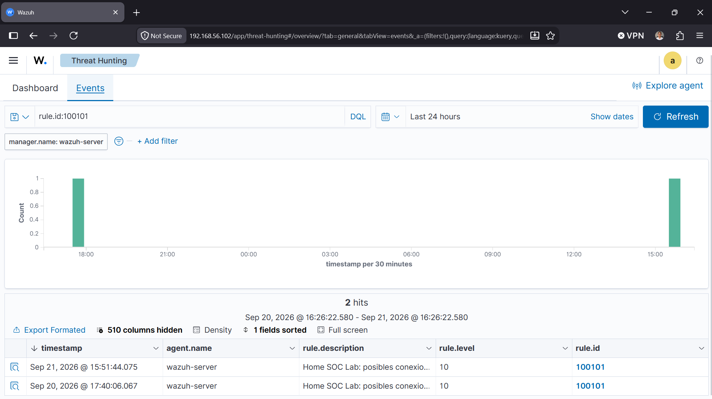
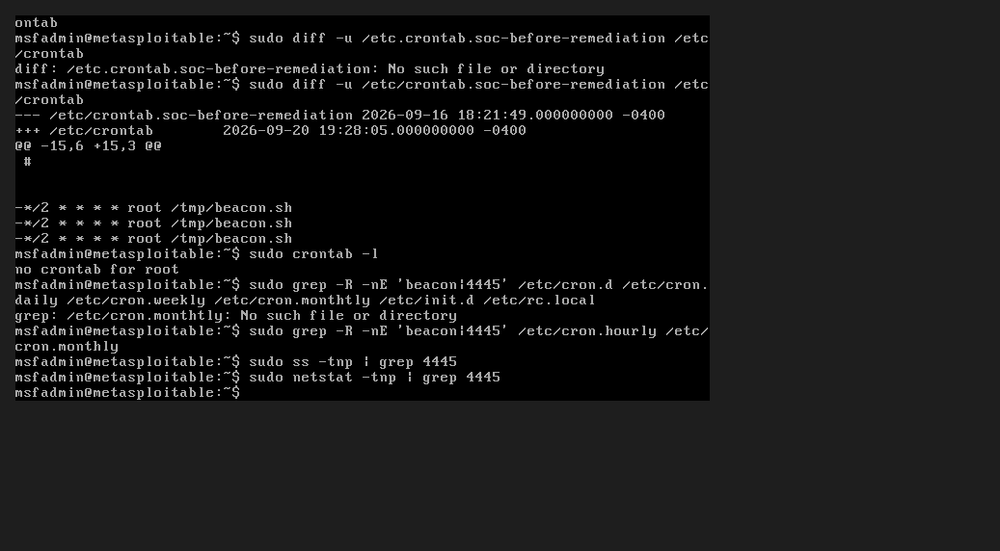
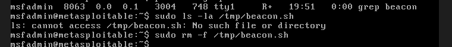
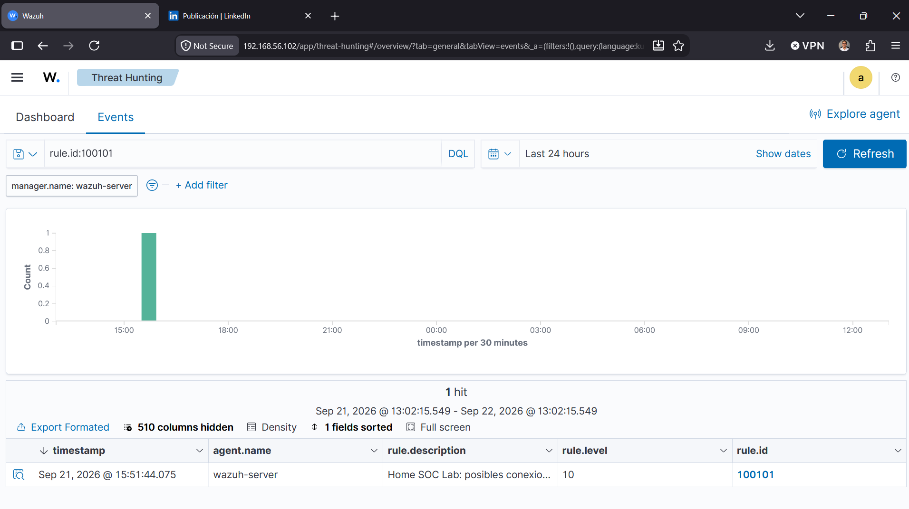

[incident-report-home-soc-lab.md](https://github.com/user-attachments/files/32584015/incident-report-home-soc-lab.md)
# Incident Response Report — Home SOC Lab

**Classification:** Simulated intrusion exercise (self-hosted lab)
**Environment:** Isolated Host-Only virtual network
**Analyst:** Daniel Diaz
**Date of exercise:** September 2026

---

## 1. Executive Summary

This report documents a full incident-response cycle carried out in a controlled home lab, built to simulate a realistic network intrusion from initial compromise through detection, containment, and eradication.

A vulnerable Linux target (Metasploitable2) was compromised via a known remote code execution vulnerability, after which an attacker-style persistence mechanism combined with a Command-and-Control (C2) beacon was installed. A SIEM stack (Wazuh) paired with a network intrusion detection system (Suricata) was used to detect the recurring C2 traffic, correlate it into a custom alert rule, and confirm the compromise. The threat was then contained and remediated, with post-remediation monitoring supporting that no further malicious activity was generated.

The exercise validates an end-to-end blue-team workflow: **Reconnaissance → Exploitation → Persistence/C2 → Detection → Containment → Eradication → Verification.**

---

## 2. Scope and Objective

**Objective:** Simulate a realistic single-host compromise and demonstrate the ability to detect, respond to, and remediate it using a self-built SIEM/NIDS stack, mirroring the workflow of a SOC analyst handling a live incident.

**Lab topology:**

| Role | System | IP Address |
|---|---|---|
| Attacker / Red Team | Kali Linux | 192.168.56.103 |
| Target / Victim | Metasploitable2 | 192.168.56.104 |
| SIEM / Blue Team | Wazuh Server + Suricata | 192.168.56.102 |

All hosts reside on a VirtualBox Host-Only network (`192.168.56.0/24`), which by design carries no route to the internet. The Wazuh server observes traffic on this segment for detection purposes; it does not act as a mandatory gateway between the attacker and target hosts.


*Logical architecture diagram. This is a simplified, documentary representation of the lab built for this report — not a live network capture.*

---

## 3. Reconnaissance

An `nmap` service scan (`nmap -sV -sC`) was run against the target (192.168.56.104) to enumerate exposed services prior to exploitation.

**Key findings:**

- vsftpd 2.3.4 (port 21) — anonymous FTP access enabled
- Samba smbd 3.0.20-Debian (ports 139/445)
- UnrealIRCd (port 6667)
- Java RMI Registry (port 1099)
- A root shell exposed directly on port 1524
- Multiple other outdated, unpatched services typical of an intentionally vulnerable host

Samba's `usermap_script` misconfiguration was selected as the exploitation vector, prioritized over the more commonly-referenced vsftpd 2.3.4 backdoor for its technical relevance and direct impact (remote code execution as root, no privilege escalation required).

---

## 4. Exploitation

**Vulnerability:** Samba "username map script" Command Execution (**CVE-2007-2447**)
**Method:** Metasploit module `exploit/multi/samba/usermap_script`, payload `cmd/unix/reverse`

The exploit was launched against 192.168.56.104, establishing a reverse command shell back to the attacker host on 192.168.56.103. Access was confirmed as **root**, with no privilege escalation step required:

```
whoami        → root
id            → uid=0(root) gid=0(root)
uname -a      → Linux metasploitable 2.6.24-16-server
```

**Timestamp of initial compromise:** 2026-09-14, 17:19:43

---

## 5. Persistence & Command-and-Control

To simulate realistic post-exploitation attacker behavior, a lightweight persistence and C2 mechanism was installed rather than a static backdoor user, combining persistence and beaconing into a single technique.

**Mechanism:**
- A cron entry was added to `/etc/crontab` on the target, executing a shell script (`/tmp/beacon.sh`) every 2 minutes.
- The script opened a reverse shell connection back to the attacker host (192.168.56.103) on a dedicated listener port, simulating periodic outbound C2 "check-in" traffic — a common real-world beaconing pattern used by malware and post-exploitation frameworks.

**Timestamp of persistence establishment / first confirmed beacon:** 2026-09-14, 21:51:42

This periodic, low-and-slow connection pattern was deliberately chosen as the detection target for the following phase, since beaconing behavior is one of the most reliable network-based indicators of an active compromise.

---

## 6. Detection

**Tools:** Suricata (network IDS) + Wazuh (SIEM / log correlation)

A custom Suricata signature was developed to flag repeated short-lived TCP connections from the target host to the attacker's listener port within a short time window — the network signature of a beaconing implant.


Suricata alerts were ingested into Wazuh via Filebeat, where a corresponding custom correlation rule (**rule ID 100101**, severity level 10) was authored to flag this pattern as a probable C2 channel.



**Confirmed detections:**

| Timestamp | Rule | Level | Description |
|---|---|---|---|
| 2026-09-20, 17:40:06 | 100101 | 10 | Home SOC Lab: possible recurring C2 connections |
| 2026-09-21, 15:51:44 | 100101 | 10 | Home SOC Lab: possible recurring C2 connections |



The alert firing on two separate days supports that the detection logic was stable rather than a one-off false positive. Note: a system clock discrepancy on the Wazuh server was identified and corrected during this exercise (see *Lessons Learned*); timestamps recorded before that correction should be read with this in mind, and these two events are treated as supporting evidence of a stable detection rule rather than as proof of two independently-timed incidents.

---

## 7. Containment & Eradication

Once detection was validated, the compromised host was remediated:

1. **Removed persistence:** The three malicious cron entries referencing `/tmp/beacon.sh` were removed from `/etc/crontab` using `sed`. A copy of the crontab was preserved before editing, and the change was verified with both a `diff` against that backup and a hash comparison of the file before and after the edit.



2. **Checked for additional persistence:** Searched `/etc/cron.d`, `/etc/cron.daily`, `/etc/cron.weekly`, `/etc/cron.hourly`, `/etc/cron.monthly`, `/etc/init.d`, and `/etc/rc.local` for any reference to the beacon or its listener port — no matches found. The root user was confirmed to have no personal crontab.



3. **Verified no active process:** Confirmed via `ps aux` that no `beacon.sh` process was running in memory.
4. **Verified no active connection:** Confirmed via `ss` and `netstat` that no TCP connection or listener remained on the C2 port.
5. **Verified artifact removal:** Confirmed the `/tmp/beacon.sh` script no longer existed on disk at the time of verification. This confirms the artifact's absence at that point in time; it does not by itself establish the exact moment the beacon process last executed.

**Timestamp of remediation:** 2026-09-20, 19:28:05 (confirmed via filesystem metadata, `stat /etc/crontab`)

---

## 8. Verification / Recovery

Following remediation, the Wazuh dashboard was monitored over the subsequent 24-hour window (2026-09-21 13:02 → 2026-09-22 13:02). Only the last pre-remediation alert (2026-09-21, 15:51:44) appeared in that window — no new alerts were generated after the cron entry was removed, supporting that the C2 channel was eradicated.



---

## 9. Indicators of Compromise (IOCs)

| Type | Indicator |
|---|---|
| Persistence mechanism | Cron entry in `/etc/crontab` executing a script every 2 minutes |
| Dropped file | `/tmp/beacon.sh` |
| Network behavior | Recurring short-lived outbound TCP connections at ~2-minute intervals to a fixed external host/port |
| Detection rule | Wazuh custom rule ID `100101`, Suricata custom signature (network trojan / C2 category) |

*(Specific payload contents, exact listener port, and full script logic are intentionally omitted from this report to avoid providing a directly reusable attack script.)*

---

## 10. Lessons Learned

- **Beaconing is a reliable detection surface.** Even a simple, low-volume periodic connection pattern was sufficient to build a working correlation rule — this mirrors how many real-world C2 frameworks are caught in production environments.
- **Systemd timeouts matter at scale.** During lab setup, both Suricata and the Wazuh indexer (OpenSearch) failed to start under default systemd timeouts due to large rule sets / JVM startup time — a reminder that infrastructure tuning is as much a part of SOC operations as detection logic itself.
- **Log pipeline visibility gaps are easy to miss.** Suricata alerts initially never reached the Wazuh dashboard due to a missing `<localfile>` block and a missing JSON decoder — a good reminder to always verify the full data pipeline end-to-end, not just that the source tool is generating logs.
- **Clock accuracy affects evidence quality.** A system clock discrepancy on the Wazuh server was found and corrected mid-exercise. This was a useful reminder that in real SOC operations, unsynchronized clocks across hosts can distort timelines and undermine confidence in correlated evidence — NTP synchronization should be a baseline check, not an afterthought.
- **Verification closes the loop.** Remediation isn't complete without gathering evidence that the malicious activity actually stopped — the post-remediation monitoring window was as important as the fix itself.

---

## 11. Evidence Notes & Known Gaps

In the interest of accuracy, this report documents the following limitations honestly rather than overstating the evidence collected:

- The architecture diagram is a documentary reconstruction built to illustrate the lab's logical layout; it is not a live configuration export.
- The exploitation phase (Section 4) is described from command history and session output; a full terminal recording of the live Metasploit session was not preserved and is not included as a screenshot in this version.
- Post-remediation TCP connection checks were performed as described in Section 7, but a final independent re-check immediately before closing this report was not separately re-captured.
- The AI-assisted alert triage component referenced as a next step in this project was not yet implemented at the time of writing.

These gaps are called out deliberately: an incident report that only shows favorable evidence is less credible than one that is transparent about what was and wasn't captured.

---

## 12. Lab Architecture

See the architecture diagram in Section 2. VirtualBox Host-Only network segment: `192.168.56.0/24`.

---

## Appendix: Full Timeline

| Date / Time | Event |
|---|---|
| 2026-09-14, 17:19:43 | Initial compromise (Samba usermap_script / CVE-2007-2447) |
| 2026-09-14, 21:51:42 | Persistence + C2 established (cron + beacon script) |
| 2026-09-20, 17:40:06 | First detection (Wazuh rule 100101) |
| 2026-09-20, 19:28:05 | Remediation performed (crontab cleaned, verified via diff + hash comparison) |
| 2026-09-21, 15:51:44 | Second detection — supports a stable, recurring detection pattern |
| 2026-09-22 | Post-remediation monitoring window shows no further alerts |


